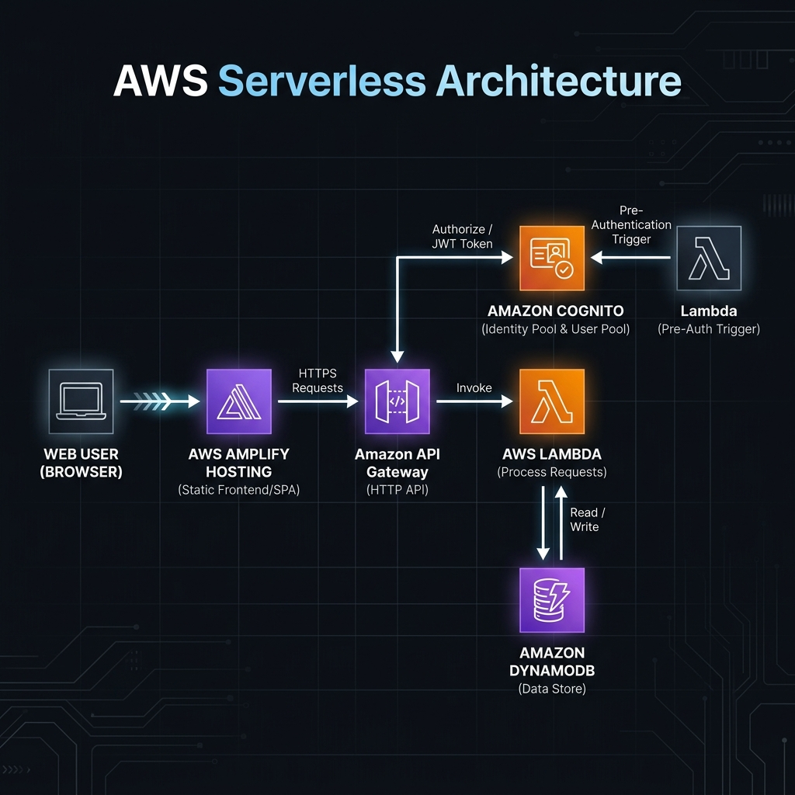

# 筋トレ記録 PWA

個人専用のマルチセット対応筋トレ記録アプリです。フロントエンドは React/Vite、バックエンドは AWS Lambda + API Gateway HTTP API + DynamoDB のサーバーレス構成です。

## AWS 構成図



> [!TIP]
> 構成図の編集を行う場合は、[docs/aws-architecture.drawio](./docs/aws-architecture.drawio) を [Draw.io (Diagrams.net)](https://app.diagrams.net/) にインポートすることで再編集が可能です。

## セキュリティ方針

公開時は Cognito User Pool のログインを必須にし、API Gateway HTTP API の JWT Authorizer で `Authorization: Bearer <id token>` を検証します。

さらに Lambda 側でも `ALLOWED_USERNAME` と Cognito の `cognito:username` claim を照合します。これにより、万が一 User Pool に別ユーザーが追加されても、指定した1ユーザー以外はAPIで `403 Forbidden` になります。

追加済みの低コスト対策:

- Cognito User Pool は管理者作成ユーザーのみ許可
- App Client は SRP 認証を使用
- API Gateway に Cognito JWT Authorizer を設定
- Lambda 側で許可ユーザー名を再チェック
- CORS の `AllowedOrigins` は `*` ではなく、Amplify の実ドメインを含む許可リストにする前提
- Lambda/API レスポンスに `Cache-Control: no-store` などのセキュリティヘッダーを付与
- Amplify Hosting 用の `customHttp.yml` で CSP、HSTS、iframe拒否などを付与

AWS WAF など月額費用が増えやすい対策は追加していません。

## DynamoDB 設計

テーブル名は `WorkoutRecords` です。

- パーティションキー: `userId` string
- ソートキー: `recordId` string
- 個人専用なので `userId` は `admin` 固定
- `recordId` は `RECORD#YYYYMMDD#timestamp` 形式
- `reps` は DynamoDB の List 型として `[10, 8, 8]` のように保存

このアプリでは `userId = admin` で Query し、取得後に `date` と `createdAt` で降順ソートします。個人利用で件数が小さい前提なので、GSIは作らず、DynamoDBの固定費を増やさない設計です。

## API

- `POST /records`
- `GET /records`
- `DELETE /records/{recordId}`

`POST /records` の例:

```json
{
  "date": "2026-05-27",
  "exercise": "ベンチプレス",
  "weight": 60,
  "reps": [10, 8, 8]
}
```

## ローカル起動

この章は任意です。CloudShell + Amplify Hosting だけでデプロイする場合、ローカルPCで以下を実行する必要はありません。

```bash
npm install
npm run dev
```

API未設定時は `localStorage` に保存するため、フロントだけでもフォーム、カレンダー連動、追加、削除を試せます。

AWS APIにつなぐ場合は `.env` を作成します。

```bash
cp .env.example .env
```

`.env`:

```bash
VITE_API_BASE_URL=https://your-api-id.execute-api.ap-northeast-1.amazonaws.com
VITE_COGNITO_USER_POOL_ID=ap-northeast-1_xxxxxxxxx
VITE_COGNITO_USER_POOL_CLIENT_ID=xxxxxxxxxxxxxxxxxxxxxxxxxx
```

## AWS バックエンド構築

この章は CloudShell での実行を前提にしています。AWS CloudShell には AWS CLI、AWS SAM CLI、Git、Node.js、npm などがあらかじめ入っているため、ローカルPCにAWS CLIやSAM CLIをインストールしなくてもバックエンドを構築できます。

参考:

- [AWS CloudShell features](https://aws.amazon.com/cloudshell/features/)
- [AWS CloudShell compute environment](https://docs.aws.amazon.com/cloudshell/latest/userguide/vm-specs.html)

この章は、AWS Solutions Architect Associate レベルの前提知識がある人が、構成意図を把握しながら作業できる粒度で書いています。

### 作成されるAWSリソース

[infra/template.yaml](./infra/template.yaml) は AWS SAM / CloudFormation テンプレートです。デプロイすると以下が作成されます。

- DynamoDB table: `WorkoutRecords`
- Lambda function: `backend/lambda_function.py`、runtimeは `python3.13`
- API Gateway HTTP API
- Cognito User Pool
- Cognito User Pool Client
- Lambda実行ロールとDynamoDBアクセス権限
- API Gateway JWT Authorizer

この構成では、静的Webアプリは Amplify Hosting、APIは API Gateway、アプリケーション処理は Lambda、永続化は DynamoDB、認証は Cognito が担当します。

### 事前準備

AWS Management Console にログインし、右上のリージョンをバックエンドを作成したいリージョンに合わせます。例では東京リージョン `ap-northeast-1` を使います。

その後、コンソール上部の CloudShell アイコンを開きます。CloudShell はコンソールで選択中のリージョンと認証済みIAMプリンシパルを使うため、ローカルのAWS認証情報設定は不要です。

CloudShellで以下を確認します。

```bash
aws --version
sam --version
git --version
node --version
npm --version
```

このテンプレートは Lambda runtime を `python3.13` にしています。CloudShellで `python3 --version` が3.13系であれば、`sam build` はそのPythonを使ってビルドできます。

```bash
python3 --version
```

リージョンが意図通りか確認します。

```bash
aws configure get region
```

何も返らない場合や別リージョンの場合は、CloudShell内で明示します。

```bash
export AWS_REGION=ap-northeast-1
export AWS_DEFAULT_REGION=ap-northeast-1
```

デプロイに使うIAMプリンシパルには、少なくとも CloudFormation、IAM Role作成、Lambda、API Gateway、DynamoDB、Cognito を作成・更新できる権限が必要です。個人開発なら管理者権限で実施しても構いませんが、本番運用では権限を絞ってください。

### ソースコードをCloudShellへ配置

おすすめはGitHubなどのGitリポジトリにこのプロジェクトをpushし、CloudShellでcloneする方法です。

```bash
git clone https://github.com/<your-account>/<your-repo>.git
cd <your-repo>
```

まだリポジトリ化していない場合は、CloudShellの `Actions > Upload file` からzipをアップロードし、展開しても構いません。

```bash
unzip workout-record-pwa.zip
cd workout-record-pwa
```

以降のコマンドは、プロジェクトルートにいる前提です。

### パラメータの考え方

SAMデプロイ時に重要なパラメータは2つです。

`AllowedOrigins`

- フロントエンドの正確なOriginをカンマ区切りで指定します。
- 例: `http://localhost:5173,https://main.xxxxx.amplifyapp.com`
- API GatewayのpreflightとLambdaの実レスポンスの両方で使います。
- 本番で `*` は使わない方針です。

`AdminUsername`

- API利用を許可するCognitoユーザー名です。
- 個人専用なら `admin` などで問題ありません。
- Lambda側でもこの値とJWT claimを照合するため、User Poolに別ユーザーがいてもAPIは使えません。

### 初回デプロイ

バックエンドをビルドしてデプロイします。

```bash
cd infra
sam build
sam deploy --guided
```

`sam deploy --guided` で聞かれる主な項目の入力例です。

```text
Stack Name: workout-records-prod
AWS Region: ap-northeast-1
Parameter AllowedOrigins: http://localhost:5173,https://<your-amplify-domain>.amplifyapp.com
Parameter AdminUsername: admin
Confirm changes before deploy: Y
Allow SAM CLI IAM role creation: Y
Disable rollback: N
Save arguments to configuration file: Y
SAM configuration file: samconfig.toml
SAM configuration environment: default
```

初回は Amplify の本番URLがまだないことが多いため、`AllowedOrigins` はいったん `http://localhost:5173` で構いません。Amplify Hosting のURLが確定した後で、同じスタックを更新して実ドメインを追加します。

デプロイ後、CloudFormation Outputs に以下が出ます。

- `ApiUrl`
- `TableName`
- `CognitoUserPoolId`
- `CognitoUserPoolClientId`

控える値:

```text
ApiUrl
CognitoUserPoolId
CognitoUserPoolClientId
```

### Cognitoユーザー作成

個人用ユーザーを1つ作成します。`--username` は `AdminUsername` と一致させます。

```bash
aws cognito-idp admin-create-user \
  --user-pool-id <CognitoUserPoolId> \
  --username admin
```

恒久パスワードを設定します。

```bash
aws cognito-idp admin-set-user-password \
  --user-pool-id <CognitoUserPoolId> \
  --username admin \
  --password '<strong-password>' \
  --permanent
```

ここで使うパスワードは Cognito User Pool のポリシーに従います。現在のテンプレートでは12文字以上、大文字・小文字・数字が必須です。

### フロントエンド環境変数

ローカルでAWS APIにつなぐ場合、プロジェクトルートに `.env` を作成します。

```bash
VITE_API_BASE_URL=<ApiUrl>
VITE_COGNITO_USER_POOL_ID=<CognitoUserPoolId>
VITE_COGNITO_USER_POOL_CLIENT_ID=<CognitoUserPoolClientId>
```

Amplify Hosting にデプロイする場合も、同じ3つを Amplify の Environment variables に設定します。

ローカルPCで起動しない運用にする場合、`.env` はCloudShellやローカルに作らなくても構いません。Amplify Hosting の環境変数にだけ設定すれば、クラウド上のビルド時に値が注入されます。

### CORSを本番Originへ更新

Amplify Hosting のURLが決まったら、バックエンドスタックの `AllowedOrigins` を更新します。

例:

```bash
cd infra
sam deploy \
  --parameter-overrides \
    AllowedOrigins=http://localhost:5173,https://main.xxxxx.amplifyapp.com \
    AdminUsername=admin
```

これにより API Gateway のCORS許可Originと、Lambdaが返す `Access-Control-Allow-Origin` が本番フロントのOriginを許可するようになります。Lambdaはリクエストの `Origin` が許可リストに含まれる場合、そのOriginを `Access-Control-Allow-Origin` として返します。

CloudShellで作業している場合も、同じコマンドをCloudShellで実行します。`samconfig.toml` を保存しているため、2回目以降は初回より入力が少なくなります。なお `samconfig.toml` には本番URLなどの環境固有の値が含まれるため、`.gitignore` に追加してありリポジトリには含まれません。

### 疎通確認

認証なしでAPIを叩くと拒否されることを確認します。

```bash
curl -i <ApiUrl>/records
```

期待値:

```text
HTTP/2 401
```

または API Gateway の認証段階で `401 Unauthorized` 相当のレスポンスになります。

フロントからログイン後に記録追加できることを確認します。確認ポイントは以下です。

- ログイン前は記録画面に入れない
- ログイン後に `GET /records` が成功する
- `POST /records` で DynamoDB に `reps` が List 型で保存される
- `DELETE /records/{recordId}` で削除される
- Cognitoに別ユーザーを作ってログインしても、APIは `403 Forbidden` になる

DynamoDB側の保存確認例:

```bash
aws dynamodb query \
  --table-name WorkoutRecords \
  --key-condition-expression "userId = :u" \
  --expression-attribute-values '{":u":{"S":"admin"}}'
```

### 運用時の更新

LambdaやAPI設定を変更した場合:

```bash
cd infra
sam build
sam deploy
```

フロントエンドだけ変更した場合:

```bash
npm run build
```

Amplify Hosting連携済みなら、Git push によって自動ビルドされます。

CloudShellだけで運用する場合、バックエンド変更はCloudShellで `git pull` してから `sam build && sam deploy`、フロントエンド変更はGitHubへpushしてAmplifyの自動ビルドに任せる、という流れが一番シンプルです。

### 削除する場合

検証環境を削除する場合:

```bash
sam delete --stack-name workout-records-prod
```

DynamoDBテーブルもスタック管理下なので削除対象です。必要なデータがある場合は、先にエクスポートしてください。

## Amplify Hosting

1. GitHub などにこのプロジェクトを push
2. AWS Amplify Hosting でリポジトリを接続
3. `amplify.yml` が自動で `npm install` と `npm run build` を実行
4. Output directory は `dist`
5. 環境変数 `VITE_API_BASE_URL`、`VITE_COGNITO_USER_POOL_ID`、`VITE_COGNITO_USER_POOL_CLIENT_ID` を設定
6. Amplify の Custom headers に `customHttp.yml` を反映

Amplify Hosting の接続はAWSコンソール上で完結します。ローカルPCで `npm install` や `npm run build` を実行する必要はありません。

## CORS 設定

`infra/template.yaml` の `WorkoutApi.CorsConfiguration` で以下を許可しています。

- Origin: `AllowedOrigins`
- Methods: `GET, POST, DELETE, OPTIONS`
- Headers: `Content-Type, Authorization`

Amplify のドメインが確定したら、SAM stack の `AllowedOrigins` に実ドメインを追加してください。`*` は使わない方針です。

## ログイン時にCSPでCognito通信がブロックされる場合

ブラウザのConsoleに以下のようなエラーが出る場合、Amplify HostingのCSP `connect-src` が Cognito のエンドポイントを許可できていません。

```text
Refused to connect to https://cognito-idp.ap-northeast-1.amazonaws.com/
because it violates the document's Content Security Policy
```

このプロジェクトの [customHttp.yml](./customHttp.yml) では、東京リージョン向けに以下を許可しています。

```text
connect-src 'self'
  https://*.execute-api.ap-northeast-1.amazonaws.com
  https://cognito-idp.ap-northeast-1.amazonaws.com
```

別リージョンでデプロイする場合は、`ap-northeast-1` を実際のリージョンに変更してください。Amplify ConsoleのCustom headersに手動設定した古いCSPが残っている場合も、同じ内容に更新します。

## 追加で入口も隠したい場合

Amplify Hosting の Access control で Basic 認証を有効化できます。これは月額課金を大きく増やさずに、URLを知っているだけの人が画面を見ることを防げます。

ただし、Basic認証だけではAPI保護にならないため、Cognito + API Gateway JWT Authorizer + Lambdaユーザー名チェックは残してください。
